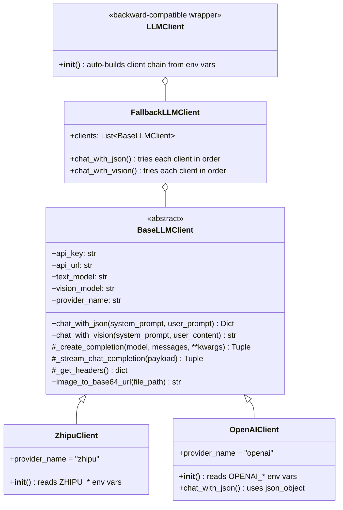
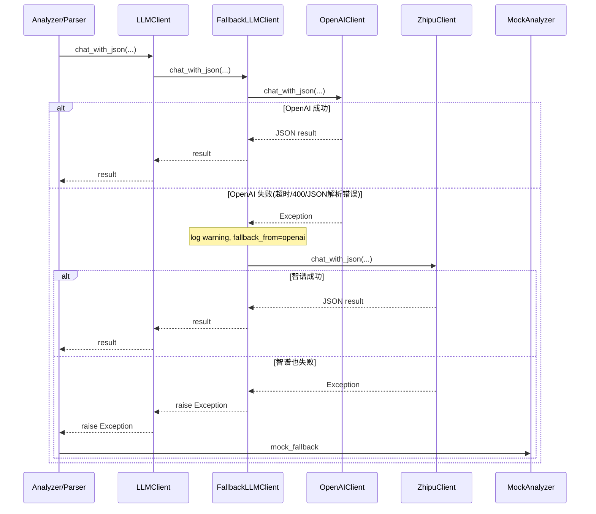

# LLM 多模型接入与回退机制开发方案

## 技术决策

- **API 协议**: 统一使用 Chat Completions API（OpenAI 和智谱格式一致，可共享 SSE/重试/JSON 解析逻辑）
- **HTTP 方案**: 继续使用 httpx，不引入 openai SDK（零新增依赖）
- **JSON 输出（阶段一）**: OpenAI 与智谱统一使用 `response_format={"type":"json_object"}`，确保回退链行为一致

## 架构设计



## 调用链路



## 文件变更清单

### 新增文件

1. **[backend/app/services/base_llm_client.py](backend/app/services/base_llm_client.py)** - 共享基类

- 从当前 `llm_client.py` 提取所有可复用逻辑：`_create_completion`、`_stream_chat_completion`、`_iter_sse_events`、`_parse_json_payload`、`_extract_json_object_text`、`_normalize_content`、`_truncate_text`、`image_to_base64_url`
- 定义抽象属性 `provider_name`
- `chat_with_json` 和 `chat_with_vision` 作为默认实现（子类可 override）
- 通用的 `__init` 接收配置参数（api_key, api_url, models, timeout 等）

1. **[backend/app/services/zhipu_client.py](backend/app/services/zhipu_client.py)** - 智谱客户端

- 继承 `BaseLLMClient`
- `__init__` 只负责读取 `ZHIPU_*` 环境变量并传给 `super().__init__`
- 设置 `provider_name = "zhipu"`
- 保留智谱特有的 `thinking_type` 参数

1. **[backend/app/services/openai_client.py](backend/app/services/openai_client.py)** - OpenAI 客户端

- 继承 `BaseLLMClient`
- `__init__` 读取 `OPENAI_*` 环境变量
- 设置 `provider_name = "openai"`
- `chat_with_json` 默认使用 `response_format: { type: "json_object" }`（与智谱一致）

1. **[backend/app/services/fallback_llm_client.py](backend/app/services/fallback_llm_client.py)** - 回退编排器

- 接收 `clients: List[BaseLLMClient]`
- `chat_with_json` / `chat_with_vision`：遍历客户端列表，成功即返回，失败则 log warning 并尝试下一个
- 全部失败则抛出最后一个异常
- 日志中记录 `provider=xxx`、`fallback_from=xxx`

### 修改文件

1. **[backend/app/services/llm_client.py](backend/app/services/llm_client.py)** - 改为向后兼容的包装器

- 删除原有 Zhipu 实现代码（已迁移到 `zhipu_client.py` / `base_llm_client.py`）
- `LLMClient.__init` 根据环境变量自动构建客户端链：
  - 有 `OPENAI_API_KEY` → 加入 `OpenAIClient`
  - 有 `ZHIPU_API_KEY` → 加入 `ZhipuClient`
  - 都没有 → 抛 `ValueError`
- 代理 `chat_with_json` / `chat_with_vision` / `image_to_base64_url` 到内部 `FallbackLLMClient`
- **效果：所有现有 `from app.services.llm_client import LLMClient` 的代码零改动**

1. **[backend/.env.example](backend/.env.example)** - 新增 OpenAI 配置

```
   OPENAI_API_KEY=
   OPENAI_API_URL=https://api.openai.com/v1/chat/completions
   OPENAI_TEXT_MODEL=gpt-4o
   OPENAI_VISION_MODEL=gpt-4o


```

### 新增测试

1. **[backend/tests/test_openai_client.py](backend/tests/test_openai_client.py)**

- Mock httpx，验证 OpenAI 请求格式正确
- 验证 `response_format={"type":"json_object"}` 与通用 JSON 解析逻辑
- 验证 Vision 请求格式

1. **[backend/tests/test_fallback_llm.py](backend/tests/test_fallback_llm.py)**

- 优先级测试：OpenAI 成功 → 不调用智谱
- 回退测试：OpenAI 失败 → 智谱成功 → 返回智谱结果
- 双失败测试：两者都失败 → 抛异常
- 验证日志中包含 `provider` 和 `fallback_from` 字段

1. **[backend/tests/test_llm_client.py](backend/tests/test_llm_client.py)** - 更新

- 适配新的 `LLMClient` 包装器
- 验证环境变量驱动的客户端链构建逻辑

## 关键实现细节

### 基类代码复用策略

当前 `LLMClient` 共 276 行，其中约 200 行是通用逻辑（SSE 解析、重试、JSON 提取），与智谱无关。提取后：

- `BaseLLMClient` ~ 200 行（通用逻辑）
- `ZhipuClient` ~ 15 行（仅 `__init` 和 `thinking_type`）
- `OpenAIClient` ~ 40 行（`__init` + `chat_with_json` override）
- `FallbackLLMClient` ~ 50 行
- `LLMClient` wrapper ~ 30 行

### OpenAI JSON 输出策略（阶段一）

```python
def chat_with_json(self, system_prompt, user_prompt):
    _, content = self._create_completion(
        model=self.text_model,
        messages=[...],
        response_format={"type": "json_object"},
    )
    return self._parse_json_payload(content)
```

阶段一不引入 `json_schema`，以保证三点：

- `LLMClient.chat_with_json(system_prompt, user_prompt)` 现有签名不变（零侵入）
- OpenAI/智谱在回退链中输出约束一致，避免同一调用在不同 provider 上行为漂移
- 测试矩阵可控，优先验证多模型回退与稳定性

### OpenAI `json_schema` 升级路径（阶段二，可选）

当以下条件满足后，再引入 `json_schema`：

- 调用方可提供稳定 schema（例如 `chat_with_json(..., schema=...)`）
- 已定义跨 provider 的一致性策略（OpenAI 严格 schema，回退 provider 的兼容方案）
- 已补充 refusal/截断/非对象输出等异常分支测试

### 日志增强

在 `FallbackLLMClient` 和 `BaseLLMClient` 中统一添加 `provider` 字段：

- 成功：`INFO LLM call succeeded (provider=openai, model=gpt-4o)`
- 回退：`WARNING LLM provider openai failed, falling back to zhipu: TimeoutError`
- 全失败：`ERROR All LLM providers failed`

## 不变的部分（确认零侵入）

以下文件/逻辑 **完全不改**：

- `backend/app/services/ai_parser.py` - 继续用 `LLMClient()`
- `backend/app/services/architecture_analyzer.py` - 继续用 `LLMClient()`
- `backend/app/services/testcase_matcher.py` - 继续用 `LLMClient()`
- `backend/app/api/` - 所有 API 路由不变
- `backend/app/models/` - 数据库模型不变
- Mock 兜底机制 - 上层的 `mock_fallback` 逻辑完全不变
