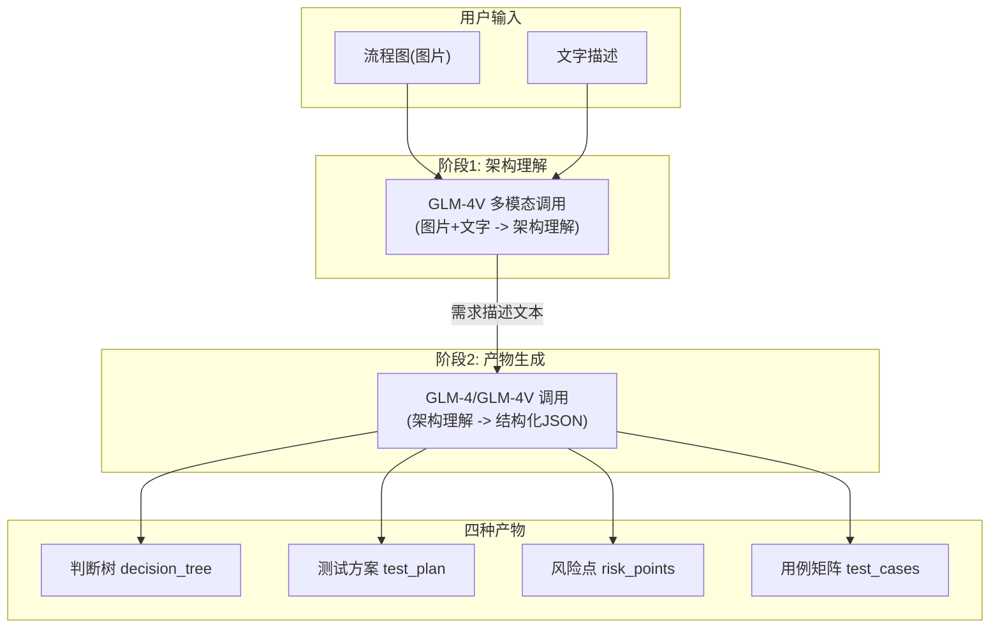

# 需求拆解模块接入智谱 GLM-4V 设计方案

## 现状分析

项目已有完善的 Provider 模式骨架：

- 抽象基类 `ArchitectureAnalyzerProvider` 定义了 `analyze()` 接口
- `MockAnalyzerProvider` 基于规则/关键词实现，生成四种产物
- `LLMAnalyzerProvider` 是占位符，直接回退到 Mock
- 通过环境变量 `ANALYZER_PROVIDER=llm` 切换引擎
- 四种产物的 Schema 已定义完毕（[architecture.py](backend/app/schemas/architecture.py)），API 层和前端展示无需改动

因此，**核心改动范围仅在 Service 层**，API 层和前端无需修改。

## 架构设计

### 总体数据流



### 两阶段调用策略

**为什么不用单次调用？** 单次调用要求多模态模型同时完成图片理解和复杂结构化 JSON 生成，容易导致输出不稳定、超出 token 限制。分两阶段可以：

- 阶段 1 专注视觉理解，质量更高
- 阶段 2 专注结构化生成，可使用 `response_format=json_object`
- 阶段 1 的结果可缓存/复用

**阶段 1 - 架构理解（多模态）：** 使用 GLM-4V-Plus 分析流程图+文字描述，输出自然语言的架构分析文本（系统概述、流程步骤、分支条件、异常路径等）。

**阶段 2 - 产物生成（结构化输出）：** 将阶段 1 的分析文本 + 原始描述作为输入，使用 GLM-4（支持 JSON Mode）生成符合 Schema 的四种产物 JSON。

### 纯文本场景优化

当用户仅提供文字描述（无图片）时，跳过阶段 1 的多模态调用，直接将文字描述送入阶段 2 生成产物，节省一次 API 调用。

## 文件变更清单

### 1. 新建 LLM 客户端封装 - [backend/app/services/llm_client.py](backend/app/services/llm_client.py)

封装智谱 API 调用逻辑，职责：

- 初始化 `ZhipuAI` 客户端（读取 API Key）
- 提供 `chat_with_vision(messages)` 方法 —— 多模态调用（图片+文本）
- 提供 `chat_with_json(messages)` 方法 —— 文本调用 + JSON Mode
- 图片 Base64 编码工具函数（本地文件 -> data URI）
- 统一的错误处理和重试（`max_retries=2`）
- 超时控制（`timeout=60s`）

```python
import base64, os
from zhipuai import ZhipuAI

class LLMClient:
    def __init__(self):
        api_key = os.getenv("ZHIPU_API_KEY", "")
        self.client = ZhipuAI(api_key=api_key)
        self.vision_model = os.getenv("ZHIPU_VISION_MODEL", "glm-4v-plus")
        self.text_model = os.getenv("ZHIPU_TEXT_MODEL", "glm-4-plus")

    def chat_with_vision(self, system_prompt: str, user_content: list) -> str:
        """多模态调用，user_content 是 [{"type":"text",...}, {"type":"image_url",...}] 格式"""
        ...

    def chat_with_json(self, system_prompt: str, user_prompt: str) -> dict:
        """文本调用 + JSON Mode，返回解析后的 dict"""
        ...

    @staticmethod
    def image_to_base64_url(file_path: str) -> str:
        """本地图片转 base64 data URI"""
        ...
```

### 2. 新建 Prompt 模板 - [backend/app/services/prompts/architecture.py](backend/app/services/prompts/architecture.py)

集中管理所有 Prompt，便于迭代调优：

- `VISION_SYSTEM_PROMPT` —— 阶段 1 系统提示词，指导模型从流程图中提取架构信息
- `VISION_USER_TEMPLATE` —— 阶段 1 用户提示词模板
- `GENERATE_SYSTEM_PROMPT` —— 阶段 2 系统提示词，包含四种产物的 JSON Schema 定义
- `GENERATE_USER_TEMPLATE` —— 阶段 2 用户提示词模板

Prompt 设计要点：

- 在 System Prompt 中明确 JSON Schema（节点类型枚举: root/condition/branch/action/exception，风险等级枚举: critical/high/medium/low）
- 要求 `decision_tree.nodes` 的 `id` 使用 `dt_N` 格式，保持与 Mock 一致
- 要求 `risk_points` 和 `test_cases` 的 `related_node_ids` 引用 `decision_tree` 中的 `id`
- 提供 few-shot 示例帮助模型理解输出格式

### 3. 修改服务层 - [backend/app/services/architecture_analyzer.py](backend/app/services/architecture_analyzer.py)

改造 `LLMAnalyzerProvider`，核心实现：

```python
class LLMAnalyzerProvider(ArchitectureAnalyzerProvider):
    def __init__(self):
        self.llm = LLMClient()

    def analyze(self, image_path, description, title=None):
        # 阶段 1: 如果有图片，使用多模态理解
        architecture_understanding = description or ""
        if image_path:
            architecture_understanding = self._vision_analyze(image_path, description)

        # 阶段 2: 生成四种产物（结构化 JSON）
        result = self._generate_artifacts(architecture_understanding, title)

        # 校验 + 兜底
        return self._validate_and_fallback(result, image_path, description, title)
```

关键方法：

- `_vision_analyze()` —— 构建多模态消息，调用 `chat_with_vision`
- `_generate_artifacts()` —— 构建 JSON 生成 prompt，调用 `chat_with_json`
- `_validate_and_fallback()` —— 校验返回结构是否符合 Schema，不符则回退 Mock

`get_analyzer_provider()` 工厂函数不变，通过 `ANALYZER_PROVIDER=llm` 激活。

### 4. 更新配置 - [backend/.env.example](backend/.env.example)

新增环境变量：

```
ANALYZER_PROVIDER=llm
ZHIPU_API_KEY=your-zhipu-api-key-here
ZHIPU_VISION_MODEL=glm-4v-plus
ZHIPU_TEXT_MODEL=glm-4-plus
LLM_REQUEST_TIMEOUT=60
LLM_MAX_RETRIES=2
```

### 5. 更新依赖 - [backend/requirements.txt](backend/requirements.txt)

新增：

```
zhipuai>=2.0.0
```

### 6. 更新测试 - [backend/tests/test_architecture_analyzer.py](backend/tests/test_architecture_analyzer.py)

- 新增 `LLMAnalyzerProvider` 的单元测试（Mock 掉 `ZhipuAI` 客户端）
- 测试正常流程：验证返回结构符合 Schema
- 测试纯文本场景：跳过阶段 1
- 测试异常兜底：模拟 LLM 调用失败，验证回退到 Mock
- 测试 JSON 解析失败：模拟 LLM 返回非法 JSON，验证兜底逻辑

## 不需要改动的部分

以下已有代码**完全不需要修改**：

- API 层 (`backend/app/api/architecture.py`) —— 通过 `get_analyzer_provider()` 自动获取引擎
- Schema 层 (`backend/app/schemas/architecture.py`) —— 四种产物结构已定义
- 前端页面和 API 客户端 —— 返回数据格式不变
- 导入逻辑 (`/import` 端点) —— 基于产物数据操作，与引擎无关

## 风险与兜底策略

| 风险                      | 应对                                                                |
| ------------------------- | ------------------------------------------------------------------- |
| LLM 返回格式不符合 Schema | `_validate_and_fallback()` 校验失败时回退 MockAnalyzerProvider      |
| API 调用超时/网络异常     | 重试 2 次，仍失败则回退 Mock 并在日志中记录，                       |
| 图片过大超出 API 限制     | 在 `image_to_base64_url()` 中检查文件大小，超限则压缩或仅用文字描述 |
| Token 超限                | 阶段 1 的描述文本截断到合理长度（如 2000 字）                       |
