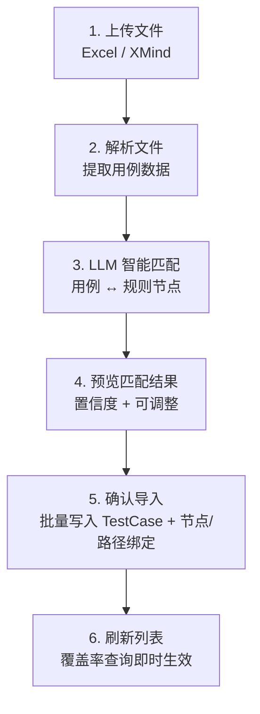
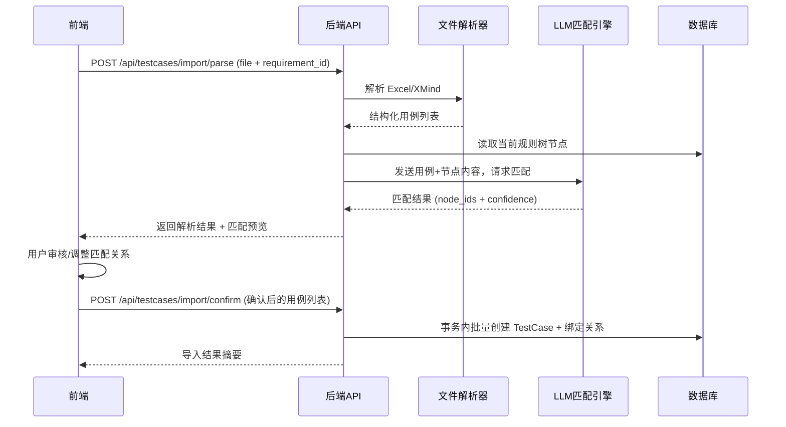

# 测试用例智能导入方案（v2）

## 1. 核心流程



## 2. 数据流设计



## 3. 后端实现

### 3.1 新增依赖

在 [backend/requirements.txt](backend/requirements.txt) 中新增：

- `openpyxl` -- Excel 解析
- `xmindparser` -- XMind 文件解析

### 3.2 文件解析服务

新建 `backend/app/services/testcase_importer.py`，负责文件解析：

**Excel 解析逻辑：**

- 读取第一个 sheet
- 自动识别表头行（通过匹配关键词：标题/用例名称/title、步骤/steps、预期结果/expected 等）
- 支持灵活列映射：用户 Excel 列名不固定时，通过关键词模糊匹配
- 每行提取为 `ParsedTestCase(title, steps, expected_result, raw_text)` -- `raw_text` 为整行拼接文本，供 LLM 匹配用
- 跳过空行，过滤无效数据

**XMind 解析逻辑：**

- 使用 `xmindparser` 解析 `.xmind` 文件为树结构
- 遍历思维导图节点树，按层级规则提取用例：
  - 第一层：模块/分类（可用作用例前缀）
  - 第二层：用例标题
  - 第三层及以下：步骤和预期结果（或子步骤）
- 如果 XMind 结构扁平（只有标题节点），则每个叶子节点视为一条用例
- 输出与 Excel 相同的 `ParsedTestCase` 列表

### 3.3 LLM 节点匹配服务

新建 `backend/app/services/testcase_matcher.py`，负责 LLM 匹配：

**核心设计：**

- 输入：`parsed_cases: List[ParsedTestCase]` + `rule_nodes: List[RuleNode]`
- 输出：`List[MatchResult]`，每个 `MatchResult` 包含：
  - `case_index`: 用例索引
  - `matched_node_ids`: 匹配到的规则节点 ID 列表
  - `confidence`: 匹配置信度 (`high` / `medium` / `low` / `none`)
  - `reason`: 匹配理由（一句话）

**LLM Prompt 策略：**

- 先做节点候选压缩：基于用例 `raw_text` 与节点 `content` 的关键词召回 TopK（默认 30）
- 将候选节点（id + content + node_type）作为上下文，避免全树长上下文
- 批量发送用例（每批 5-10 条，避免超长 token）
- 复用已有 `LLMClient.chat_with_json` + 归一化兜底机制
- 对 LLM 返回的 `matched_node_ids` 做白名单过滤：只保留候选集合内且 DB 存在的节点 ID

新建 `backend/app/services/prompts/testcase_match.py`，Prompt 模板：

```python
MATCH_SYSTEM_PROMPT = """你是一个测试专家。你需要将测试用例匹配到规则树的节点上。
规则树描述了业务逻辑的条件、分支和动作。
对于每条测试用例，找出它验证了哪些规则节点。"""

MATCH_USER_TEMPLATE = """## 规则树节点
{nodes_json}

## 待匹配测试用例
{cases_json}

请以 JSON 格式返回匹配结果：
{{"matches": [
  {{"case_index": 0, "matched_node_ids": ["node_id_1", "node_id_2"],
    "confidence": "high", "reason": "该用例验证了..."}},
  ...
]}}"""
```

**兜底策略：**

- 若 LLM 调用失败：退化为基于关键词的简单匹配（从用例文本中提取关键词，与节点 content 做文本相似度匹配）
- 若某条用例完全无匹配：`confidence` 标记为 `none`，前端标红提示人工处理

### 3.4 新增 API

新建 `backend/app/api/testcase_import.py`，两个核心接口：

**接口 1：上传解析 + LLM 匹配**

- `POST /api/testcases/import/parse`
- 入参：`multipart/form-data` -- `file` (Excel/XMind) + `requirement_id`
- 流程：解析文件 → 读取规则树 → LLM 批量匹配 → 返回预览
- 出参：

```python
{
  "parsed_cases": [
    {
      "index": 0,
      "title": "用例标题",
      "steps": "步骤内容",
      "expected_result": "预期结果",
      "matched_node_ids": ["node_id_1", "node_id_2"],
      "matched_node_contents": ["节点内容1", "节点内容2"],
      "confidence": "high",
      "match_reason": "该用例验证了条件A和分支B"
    }
  ],
  "total_cases": 15,
  "auto_matched": 12,
  "need_review": 3,
  "analysis_mode": "llm"  # llm / mock_fallback
}
```

**接口 2：确认批量导入**

- `POST /api/testcases/import/confirm`
- 入参：用户调整后的可导入用例列表
- 约束：`cases[*].bound_rule_node_ids` 至少 1 个（未绑定用例必须“跳过”，不能导入）

```python
{
  "requirement_id": 1,
  "project_id": 1,
  "cases": [
    {
      "title": "用例标题",
      "steps": "步骤",
      "expected_result": "预期结果",
      "risk_level": "medium",
      "bound_rule_node_ids": ["node_id_1"],
      "bound_path_ids": []
    }
  ]
}
```

- 流程：参数校验 → 事务内批量创建 TestCase → 建立绑定关系
- 不执行 RulePath 重算（RulePath 由 RuleNode 变更驱动，导入 TestCase 不改变路径）
- 出参：

```python
{
  "imported_count": 15,
  "bound_count": 15,
  "skipped_count": 3
}
```

### 3.5 Schema 定义

新建 `backend/app/schemas/testcase_import.py`：

- `ParsedCasePreview` -- 单条用例解析+匹配预览
- `ImportParseResponse` -- 解析接口响应
- `ImportConfirmRequest` -- 确认导入请求
- `ImportConfirmResponse` -- 导入结果响应

### 3.6 导入校验与事务规则（新增）

- `requirement_id` 必须存在，且归属于 `project_id`
- `bound_rule_node_ids` 全部必须存在，且全部 `RuleNode.requirement_id == request.requirement_id`
- `bound_path_ids` 全部必须存在，且全部 `RulePath.requirement_id == request.requirement_id`
- 每条用例：`bound_path_ids` 中每条路径必须包含该用例 `bound_rule_node_ids` 全集
- 批量导入使用单事务；任一条校验失败整批回滚并返回 400
- 建议错误码：
  - `invalid_project_requirement_relation`
  - `unbound_case_not_allowed`
  - `invalid_bound_rule_node_ids`
  - `invalid_bound_path_ids`
  - `path_node_mismatch`

## 4. 前端实现

### 4.1 入口位置

在现有 **用例管理页面** (`frontend/src/pages/TestCases/index.tsx`) 中新增「导入用例」按钮，点击后打开导入抽屉/模态框。

### 4.2 导入向导 UI（三步）

**Step 1 - 上传文件：**

- 拖拽上传区（Ant Design `Upload.Dragger`），支持 `.xlsx` / `.xmind` 文件
- 选择关联的需求（默认当前选中需求）
- 点击「开始解析」调用 `POST /api/testcases/import/parse`

**Step 2 - 预览匹配结果：**

- 表格展示解析出的每条用例：
  - 标题 | 步骤(缩略) | 预期结果(缩略) | 匹配节点 | 置信度 | 匹配理由
- 置信度 Tag 颜色：`high=green`、`medium=gold`、`low=orange`、`none=red`
- 匹配节点列可编辑：点击后弹出规则节点多选下拉框，用户可手动增删匹配
- 支持批量操作：全选/反选、批量设置风险等级
- 未匹配（`none`）的行标红，提示「需要手动指定节点」
- 可将未处理行标记为“跳过导入”

**Step 3 - 确认导入：**

- 展示导入摘要：总计 N 条用例，其中已匹配 M 条、未绑定 K 条
- 未绑定用例仅可选择：手动绑定后导入 / 跳过
- 点击「确认导入」调用 `POST /api/testcases/import/confirm`
- 导入成功后自动刷新用例列表

### 4.3 新增前端 API 封装

在 `frontend/src/api/testcases.ts` 中新增：

```typescript
export async function parseImportFile(file: File, requirementId: number) { ... }
export async function confirmImport(payload: ImportConfirmPayload) { ... }
```

- `parseImportFile` 单独设置请求超时 `120000ms`（避免默认 15s 超时）

### 4.4 类型定义

在 `frontend/src/types/index.ts` 中新增导入相关类型。

## 5. 关键设计决策

- **LLM 批量匹配而非逐条**：将 5-10 条用例打包发送给 LLM，减少调用次数，降低耗时和成本
- **预览确认机制**：LLM 匹配结果仅作为建议，用户有最终决定权，避免误匹配污染数据
- **置信度分级**：让用户可以快速聚焦低置信度的用例进行人工审核，而非逐条检查
- **关键词兜底**：LLM 不可用时降级为关键词匹配，保证功能可用性
- **复用现有 LLM 基础设施**：直接使用 `LLMClient.chat_with_json`，无需额外集成
- **XMind 层级自动推断**：根据思维导图的层级深度自动判断哪些是用例标题、哪些是步骤
- **未绑定不导入**：避免当前需求过滤视角下“导入成功但不可见”的数据体验问题
- **导入不重算 RulePath**：路径仅在规则树变化时重算，避免无意义开销和副作用
- **强校验 + 单事务**：防止跨需求错误绑定和部分成功的脏数据

## 6. 涉及文件清单

**新增文件：**

- `backend/app/services/testcase_importer.py` -- 文件解析服务
- `backend/app/services/testcase_matcher.py` -- LLM 匹配服务
- `backend/app/services/prompts/testcase_match.py` -- 匹配 Prompt 模板
- `backend/app/api/testcase_import.py` -- 导入 API
- `backend/app/schemas/testcase_import.py` -- 导入 DTO

**修改文件：**

- `backend/requirements.txt` -- 新增 openpyxl, xmindparser
- `backend/app/main.py` -- 注册新路由
- `frontend/src/pages/TestCases/index.tsx` -- 添加导入入口
- `frontend/src/api/testcases.ts` -- 新增导入 API
- `frontend/src/types/index.ts` -- 新增导入类型
- `backend/tests/test_testcase_import_api.py` -- 新增导入接口与校验测试
- `KNOWLEDGE_BASE.md` -- 更新文档

## 7. 验收标准

- 支持 `.xlsx` / `.xmind` 两种文件导入
- `parse` 接口可返回可编辑预览、置信度、匹配理由、`analysis_mode`
- 未绑定用例不能进入 `confirm` 导入（仅可跳过）
- 任意非法节点/路径 ID 或归属错误时，`confirm` 返回 400 且不落库
- 导入后测试用例列表可正常刷新显示，覆盖率接口查询结果即时反映绑定关系
