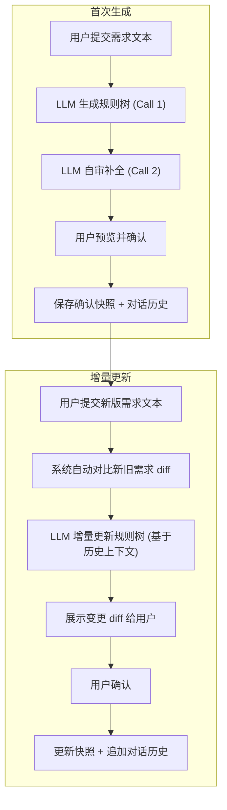

# 规则树对话式生成与增量更新方案

## 核心思路

引入 **Session（会话）** 概念，每个需求的规则树生成过程是一个持续会话：

- 首次生成：LLM 生成 -> LLM 自审补全 -> 用户确认
- 版本迭代：用户提交新版需求 -> 系统自动 diff -> LLM 基于旧规则树上下文增量更新 -> 用户确认



## 一、数据模型新增

在 [backend/app/models/entities.py](backend/app/models/entities.py) 中新增两个表：

**RuleTreeSession** - 规则树生成会话

| 字段                      | 类型                            | 说明                          |
| ------------------------- | ------------------------------- | ----------------------------- |
| id                        | Integer PK                      | 会话 ID                       |
| requirement_id            | FK -> requirements              | 关联需求                      |
| title                     | String(255)                     | 会话标题（如"需求A v1 生成"） |
| status                    | Enum(active/confirmed/archived) | 会话状态                      |
| confirmed_tree_snapshot   | Text (JSON)                     | 确认时的规则树快照            |
| requirement_text_snapshot | Text                            | 确认时的需求文本              |
| created_at / updated_at   | DateTime                        | 时间戳                        |

**RuleTreeMessage** - 对话消息

| 字段          | 类型                     | 说明                                             |
| ------------- | ------------------------ | ------------------------------------------------ |
| id            | Integer PK               | 消息 ID                                          |
| session_id    | FK -> rule_tree_sessions | 关联会话                                         |
| role          | String(20)               | system / user / assistant                        |
| content       | Text                     | 消息内容（需求文本 / LLM 响应 JSON 等）          |
| message_type  | String(50)               | generate / review / incremental_update / confirm |
| tree_snapshot | Text (JSON, nullable)    | 该消息时刻的规则树快照                           |
| created_at    | DateTime                 | 时间戳                                           |

## 二、LLM 调用层扩展

当前 `BaseLLMClient` 的 `_create_completion()` 已经接受 `messages: List[Dict]`，天然支持多轮对话。

在 [backend/app/services/base_llm_client.py](backend/app/services/base_llm_client.py) 中新增方法：

```python
def chat_with_messages(self, messages: List[Dict[str, Any]], response_format=None) -> Dict[str, Any]:
    """支持传入完整对话历史的 JSON 对话方法"""
    _, content = self._create_completion(
        model=self.text_model,
        messages=messages,
        **({"response_format": response_format} if response_format else {}),
    )
    return self._parse_json_payload(content)
```

同步在 `LLMClient` / `FallbackLLMClient` 中透传此方法。

## 三、Prompt 设计

在 [backend/app/services/prompts/](backend/app/services/prompts/) 下新建 `rule_tree_session.py`：

### 3.1 自审补全 Prompt（Review）

作为 assistant 生成后的第二轮调用，系统传入第一轮的生成结果，让 LLM 自己审查：

```
你是测试设计审查专家。请审查你刚才生成的规则树，基于原始需求检查：
1) 是否遗漏了关键条件分支（尤其是异常/边界场景）
2) 是否有语义重复或冗余的节点
3) 节点粒度是否合理（既不过粗也不过细）
4) 父子关系是否逻辑正确

【约束】
- 改进后的节点，保持原有 id 不变
- 新增节点使用新的 dt_N id
- 输出完整的改进后 JSON，格式与之前一致
- 如果无需改进，原样返回
```

实际调用时构造的 messages 为：

1. system: GENERATE_SYSTEM_PROMPT（复用现有）
2. user: 原始需求（第一轮 user 消息）
3. assistant: 第一轮生成结果
4. user: 上述审查指令

### 3.2 增量更新 Prompt（Incremental Update）

```
需求已从版本 N 更新到版本 N+1，请基于已确认的规则树进行增量更新。

【旧版需求】
{old_requirement}

【新版需求】
{new_requirement}

【需求变更摘要】
{auto_diff}

【当前已确认的规则树】
{current_rule_tree_json}

【约束】
1) 未涉及变更的节点，必须保持 id、content、type、risk_level 等完全不变
2) 仅对涉及变更的部分进行 新增/修改/删除
3) 修改的节点保持原 id，更新 content 等字段
4) 新增节点使用新的 dt_N id（N 不与已有 id 冲突）
5) 需要删除的节点不要出现在输出中
6) 输出完整的规则树 JSON
```

## 四、核心服务

新建 [backend/app/services/rule_tree_session.py](backend/app/services/rule_tree_session.py)：

**核心方法：**

- `create_session(db, requirement_id, title)` -> Session
- `generate_with_review(db, session_id, requirement_text, title, image_path=None)`
  - Step 1: 构造 generate messages，调用 LLM
  - Step 2: 将生成结果追加为 assistant 消息，再追加 review 指令
  - Step 3: 调用 LLM 自审，得到改进后的规则树
  - Step 4: 保存所有消息到 RuleTreeMessage
  - 返回: 审查后的规则树 + 两次结果的 diff 摘要
- `incremental_update(db, session_id, new_requirement_text)`
  - Step 1: 从 Session 取出已确认的 `requirement_text_snapshot` 和 `confirmed_tree_snapshot`
  - Step 2: 用 `difflib.unified_diff` 自动对比新旧需求文本
  - Step 3: 构造增量更新 messages（包含历史上下文），调用 LLM
  - Step 4: 对比新旧规则树，生成节点级 diff（新增/修改/删除列表）
  - Step 5: 保存消息
  - 返回: 更新后的规则树 + 节点变更清单
- `confirm_tree(db, session_id, tree_json, requirement_text)`
  - 保存快照到 Session
  - 追加 confirm 消息
  - 执行实际的 RuleNode 导入/更新
- `build_messages_for_llm(session_id)` - 从对话历史构建 LLM messages 数组
- `compute_tree_diff(old_tree, new_tree)` - 对比两棵规则树的节点级差异

**需求文本 diff 工具（内置于同文件）：**

```python
import difflib

def compute_requirement_diff(old_text: str, new_text: str) -> str:
    diff = difflib.unified_diff(
        old_text.splitlines(), new_text.splitlines(),
        fromfile='旧版需求', tofile='新版需求', lineterm=''
    )
    return '\n'.join(diff)
```

**规则树节点 diff（返回给前端展示）：**

按 node id 匹配：

- 旧有但新没有 -> deleted
- 新有但旧没有 -> added
- 两边都有但 content/type 变了 -> modified
- 两边都有且内容一致 -> unchanged

## 五、API 端点

新建 [backend/app/api/rule_tree_session.py](backend/app/api/rule_tree_session.py)，挂载到 `/api/rules/sessions`：

- `POST /api/rules/sessions` - 创建会话（参数：requirement_id, title）
- `GET /api/rules/sessions?requirement_id=X` - 列出某需求的所有会话
- `GET /api/rules/sessions/{session_id}` - 获取会话详情 + 对话消息列表
- `POST /api/rules/sessions/{session_id}/generate` - 首次生成+自审（参数：requirement_text, title, image）
- `POST /api/rules/sessions/{session_id}/update` - 增量更新（参数：new_requirement_text）
- `POST /api/rules/sessions/{session_id}/confirm` - 确认并导入规则树

在 [backend/app/main.py](backend/app/main.py) 中注册新 router。

## 六、前端改造

### 6.1 RuleTree 页面（[frontend/src/pages/RuleTree/index.tsx](frontend/src/pages/RuleTree/index.tsx)）

新增功能区域：

- **会话选择器**：下拉列出当前需求的历史会话，或创建新会话
- **对话历史面板**：右侧或底部抽屉，展示每轮对话（类似聊天界面），包含：
  - 用户提交的需求文本
  - LLM 生成的规则树预览
  - 自审补全后的改进版本
  - 增量更新的变更记录
- **操作按钮**：
  - "AI 生成" -> 触发 generate + review 流程
  - "需求变更" -> 弹窗输入新版需求文本，触发增量更新
  - "确认导入" -> 将当前预览的规则树写入正式数据

### 6.2 Diff 展示

增量更新后，展示规则树节点变更对比：

- 绿色高亮新增节点
- 黄色高亮修改节点（显示旧值->新值）
- 红色标记删除节点
- 灰色为未变更节点

### 6.3 新增 API 调用

在 `frontend/src/api/` 下新增 `ruleTreeSession.ts`，封装上述后端接口。

## 七、与现有功能的关系

- **架构分析生成**（`/api/ai/architecture/analyze`）：保持不变，作为"快速生成"入口。用户如果想进入会话模式，可以在架构分析结果的基础上创建 Session。
- **AI 文本解析**（`/api/ai/parse`）：同理，作为轻量快捷入口保持不变。
- **规划中的 RuleTreeSnapshot**（`docs/plans/规则树版本快照与diff`）：Session 的 `confirmed_tree_snapshot` 就是快照，两者可以复用。后续如果实现独立快照表，Session confirm 时同步写入即可。

## 八、关键设计要点

- **对话历史裁剪**：当消息过多时（超过 LLM 上下文窗口），只保留 system prompt + 最近一次 confirmed 快照 + 最新几轮对话，避免 token 溢出
- **增量更新的"锚点"**：每次 confirm 后的快照作为下一次增量更新的基准，而非基于中间过程的草稿
- **幂等性**：confirm 操作需要检查 Session 状态，避免重复导入
- **向后兼容**：现有的"架构分析"和"AI 解析"流程完全不受影响
