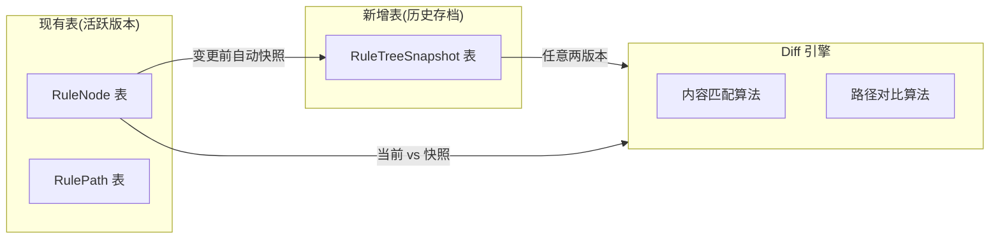
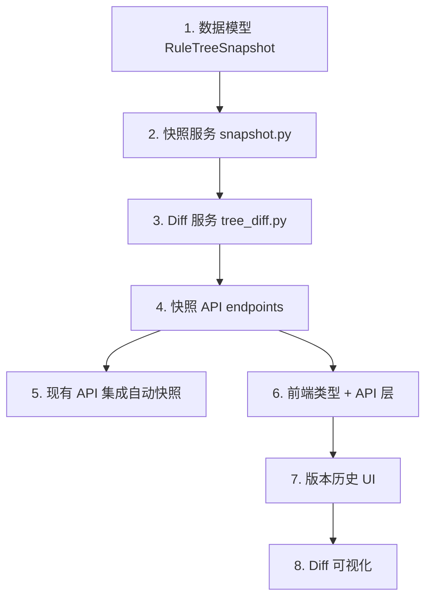

# 规则树版本快照与 Diff 对比方案

## 当前现状

- 规则树以 `Requirement` 为边界，每个需求一棵树
- `RuleNode` 有 `version`（修改计数器）和 `status`（active/modified/deleted），但没有树级别的版本概念
- `RulePath` 是从 `RuleNode` 通过 DFS 派生的，存储 `node_sequence`（逗号分隔的节点 ID）
- 节点删除为软删（`status=deleted`），但无法回溯到某个完整的历史状态
- 无 Alembic 迁移工具，数据库通过 SQLAlchemy `create_all` 管理

## 设计方案：混合架构（现有关系模型 + JSON 快照存档）

核心思路：**现有的 `RuleNode`/`RulePath` 表保持不变**，继续作为「当前活跃版本」的工作区。新增一个 `RuleTreeSnapshot` 表，以 JSON 方式保存历史版本的完整树快照。



**选择此方案的理由：**

- 对现有代码零侵入：所有现有 API、前端页面、覆盖率计算、影响分析、回归推荐等功能完全不受影响
- 快照为只读归档，不参与业务运算，结构简单可靠
- Diff 在展示层按需计算，不需要持久化存储

---

## 一、数据模型变更

### 新增 `RuleTreeSnapshot` 模型

文件：[backend/app/models/entities.py](backend/app/models/entities.py)

```python
class RuleTreeSnapshot(Base):
    __tablename__ = "rule_tree_snapshots"

    id = Column(Integer, primary_key=True, index=True)
    requirement_id = Column(Integer, ForeignKey("requirements.id"), nullable=False, index=True)
    version_number = Column(Integer, nullable=False)
    trigger = Column(String(64), nullable=False)   # "ai_regenerate" | "manual_edit" | "import"
    snapshot_data = Column(Text, nullable=False)     # JSON: { nodes: [...], paths: [...] }
    description = Column(Text, nullable=True)        # 用户可选备注
    created_at = Column(DateTime, default=datetime.utcnow, nullable=False)

    requirement = relationship("Requirement", back_populates="snapshots")

    __table_args__ = (
        UniqueConstraint("requirement_id", "version_number", name="uq_req_version"),
    )
```

`snapshot_data` JSON 结构：

```json
{
  "nodes": [
    {
      "id": "uuid-1",
      "parent_id": null,
      "node_type": "root",
      "content": "用户提现流程",
      "risk_level": "high",
      "version": 3,
      "status": "active"
    }
  ],
  "paths": [
    { "id": "path-uuid-1", "node_sequence": ["uuid-1", "uuid-2", "uuid-3"] }
  ]
}
```

### 在 `Requirement` 模型添加关系

文件：[backend/app/models/entities.py](backend/app/models/entities.py)，在 `Requirement` 类中添加：

```python
snapshots = relationship("RuleTreeSnapshot", back_populates="requirement", cascade="all, delete-orphan")
```

---

## 二、后端 Schema

### 新增 Pydantic Schema

文件：新建 [backend/app/schemas/snapshot.py](backend/app/schemas/snapshot.py)

```python
class SnapshotSummary(BaseModel):
    id: int
    requirement_id: int
    version_number: int
    trigger: str
    description: Optional[str]
    node_count: int
    path_count: int
    created_at: datetime

class SnapshotDetail(SnapshotSummary):
    nodes: List[RuleNodeRead]
    paths: List[RulePathRead]

class DiffNodeChange(BaseModel):
    status: str          # "added" | "removed" | "modified" | "unchanged"
    current: Optional[dict]
    previous: Optional[dict]
    changes: Optional[List[str]]  # 变更字段列表，如 ["content", "risk_level"]

class DiffPathChange(BaseModel):
    status: str          # "added" | "removed" | "unchanged"
    current_path_content: Optional[List[str]]   # 用节点 content 表示
    previous_path_content: Optional[List[str]]

class TreeDiffResult(BaseModel):
    base_version: int
    compare_version: int    # 0 表示当前活跃版本
    summary: dict           # { added: int, removed: int, modified: int, unchanged: int }
    node_changes: List[DiffNodeChange]
    path_changes: List[DiffPathChange]
```

---

## 三、后端服务层 -- 核心逻辑

### 3.1 快照服务

文件：新建 [backend/app/services/snapshot.py](backend/app/services/snapshot.py)

核心函数：

- `create_snapshot(db, requirement_id, trigger, description=None) -> RuleTreeSnapshot`
  - 查询当前活跃的 `RuleNode`（status != deleted）和 `RulePath`
  - 序列化为 JSON 存入 `snapshot_data`
  - `version_number` = 当前需求下最大 version_number + 1（首次为 1）
- `list_snapshots(db, requirement_id) -> List[SnapshotSummary]`
  - 返回该需求下所有快照摘要，按 version_number 降序
- `get_snapshot_detail(db, snapshot_id) -> SnapshotDetail`
  - 返回快照完整数据（反序列化 JSON）

### 3.2 Diff 服务

文件：新建 [backend/app/services/tree_diff.py](backend/app/services/tree_diff.py)

核心算法：

**节点匹配策略（基于内容，因 AI 重新生成后 ID 不同）**：

1. 优先精确匹配：`node_type + content` 完全一致 -> `unchanged`
2. 次级模糊匹配：`node_type` 相同 + `content` 相似度 > 0.8（使用 `difflib.SequenceMatcher`） -> `modified`
3. 未匹配的旧节点 -> `removed`
4. 未匹配的新节点 -> `added`

**路径对比策略**：

1. 将路径的 `node_sequence`（节点 ID 序列）转化为 `content_sequence`（节点内容序列）
2. 对比两个版本的内容序列列表
3. 完全一致 -> `unchanged`，仅在新版存在 -> `added`，仅在旧版存在 -> `removed`

核心函数：

- `diff_trees(old_tree_data: dict, new_tree_data: dict) -> TreeDiffResult`
- `_match_nodes(old_nodes, new_nodes) -> List[DiffNodeChange]`
- `_match_paths(old_paths, new_paths, old_nodes, new_nodes) -> List[DiffPathChange]`

---

## 四、后端 API 层

文件：新建 [backend/app/api/snapshots.py](backend/app/api/snapshots.py)

| 方法   | 路径                                                      | 说明                   |
| ------ | --------------------------------------------------------- | ---------------------- |
| POST   | `/api/snapshots`                                          | 手动创建快照           |
| GET    | `/api/snapshots/requirements/{requirement_id}`            | 获取需求的快照列表     |
| GET    | `/api/snapshots/{snapshot_id}`                            | 获取快照详情           |
| GET    | `/api/snapshots/{snapshot_id}/diff`                       | 快照与当前活跃版本对比 |
| GET    | `/api/snapshots/{snapshot_id}/diff/{compare_snapshot_id}` | 两个快照之间对比       |
| DELETE | `/api/snapshots/{snapshot_id}`                            | 删除快照（可选）       |

### 在现有 API 中集成自动快照

需要在以下触发点自动创建快照：

**1. AI 重新生成规则树时**

文件：[backend/app/api/architecture.py](backend/app/api/architecture.py) 的 `import_analysis` 函数

在 `if payload.import_decision_tree:` 之前，检查需求下是否已有规则节点：

- 如果有 -> 自动调用 `create_snapshot(db, requirement.id, trigger="ai_regenerate")`
- 然后再执行导入逻辑

**2. AI 半自动解析导入时**

文件：[backend/app/api/rules.py](backend/app/api/rules.py)

新增一个批量导入接口 `POST /api/rules/batch-import`，在导入前自动创建快照。当前前端的 `importAIDraft` 逐个调用 `createRuleNode` 无法在一个事务中处理快照，需要改为批量接口。

---

## 五、前端变更

### 5.1 类型定义

文件：[frontend/src/types/index.ts](frontend/src/types/index.ts)

新增：

```typescript
export interface RuleTreeSnapshot {
  id: number;
  requirement_id: number;
  version_number: number;
  trigger: "ai_regenerate" | "manual_edit" | "import";
  description: string | null;
  node_count: number;
  path_count: number;
  created_at: string;
}

export interface TreeDiffNodeChange {
  status: "added" | "removed" | "modified" | "unchanged";
  current: Partial<RuleNode> | null;
  previous: Partial<RuleNode> | null;
  changes: string[] | null;
}

export interface TreeDiffPathChange {
  status: "added" | "removed" | "unchanged";
  current_path_content: string[] | null;
  previous_path_content: string[] | null;
}

export interface TreeDiffResult {
  base_version: number;
  compare_version: number;
  summary: {
    added: number;
    removed: number;
    modified: number;
    unchanged: number;
  };
  node_changes: TreeDiffNodeChange[];
  path_changes: TreeDiffPathChange[];
}
```

### 5.2 API 层

文件：新建 `frontend/src/api/snapshots.ts`

### 5.3 规则树页面集成

文件：[frontend/src/pages/RuleTree/index.tsx](frontend/src/pages/RuleTree/index.tsx)

新增功能：

1. **版本历史按钮**：在顶部工具栏添加「版本历史」按钮
2. **版本列表抽屉**：展示该需求的所有快照版本，包含版本号、触发原因、节点数、时间
3. **Diff 对比视图**：

- 在思维导图上用颜色标记差异节点：
  - 绿色边框 = 新增节点
  - 红色边框/半透明 = 删除节点
  - 黄色边框 = 修改节点
  - 无特殊标记 = 未变化节点
- 在 MindMapNode 组件中增加 `diffStatus` 属性

4. **快照查看模式**：点击历史版本可以查看该版本的完整规则树（只读模式）

### 5.4 MindMapNode 组件扩展

文件：[frontend/src/pages/RuleTree/MindMapNode.tsx](frontend/src/pages/RuleTree/MindMapNode.tsx)

在 `MindMapNodeData` 中新增可选字段 `diffStatus?: "added" | "removed" | "modified" | "unchanged"`，根据此字段渲染不同的边框颜色。

---

## 六、实施顺序与依赖关系



---

## 七、关键注意事项

- **数据库迁移**：项目当前使用 `Base.metadata.create_all()` 自动建表，新增 `RuleTreeSnapshot` 模型后会自动创建表。但如果已有数据的生产环境，需要确认是否会影响已有表。
- **快照大小**：JSON 快照会随节点数增长。中型规则树（100 节点）约 50KB，可接受。
- **内容匹配精度**：基于内容文本的匹配策略在大部分场景下足够准确。如果需求文本重复率很高（多个节点内容相同），可以结合 `node_type + parent 内容` 做更精确的定位。
- **测试用例绑定**：快照只做归档展示，不影响现有的 `case_rule_node_assoc` 绑定关系。用例始终绑定到活跃版本的节点。
