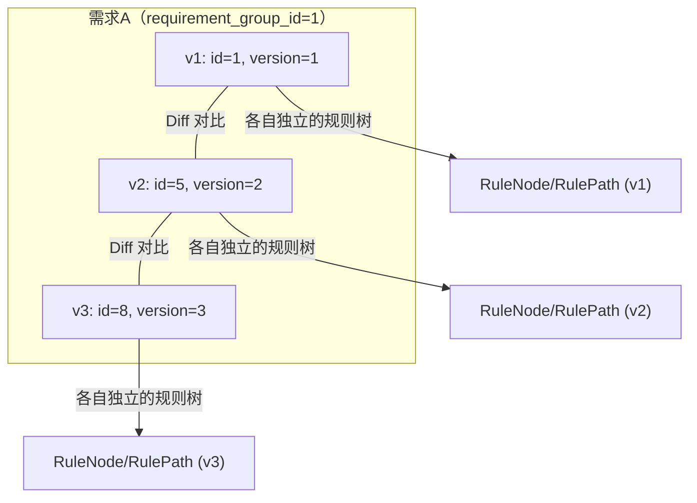
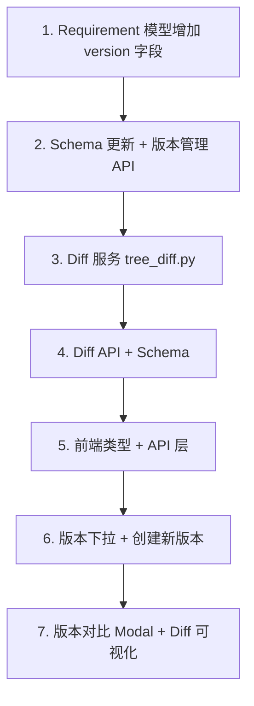

# 规则树版本对比方案（需求版本化）

## 核心思路

**不用 JSON 快照**，而是让需求本身支持多版本。每个版本就是一条独立的 `Requirement` 记录，拥有自己完整的 `RuleNode` / `RulePath` 规则树。通过 `requirement_group_id` 将同一需求的多个版本串联起来。

用户操作流程：

1. 创建需求 A（自动成为 v1）
2. 需求 A 有更新时，点击"创建新版本"-> 生成 v2（空白规则树）
3. 在 v2 上用 AI 重新生成规则树，或手动创建
4. 通过下拉切换 v1 / v2 查看
5. 选择 v1 和 v2 进行 Diff 对比



**关键决策（已确认）：**

- 新版本从空白开始，用户重新 AI 生成或手动创建
- 测试用例始终绑定到最新版本的规则树节点
- 老版本规则树只读，仅供查看和对比

---

## Phase 1: 后端 -- 数据模型变更

### 1.1 Requirement 模型新增字段

文件: [backend/app/models/entities.py](backend/app/models/entities.py)

在 `Requirement` 类中新增两个字段：

```python
class Requirement(Base):
    # ... existing fields ...
    version = Column(Integer, default=1, nullable=False)
    requirement_group_id = Column(Integer, nullable=True, index=True)
```

- `version`: 版本号，从 1 开始递增
- `requirement_group_id`: 版本组 ID，同一需求的所有版本共享同一个值（等于第一个版本的 `id`）。NULL 表示只有一个版本（尚未创建过新版本）

版本分组规则：

- v1 创建时: `requirement_group_id = NULL`, `version = 1`
- 创建 v2 时: 更新 v1 的 `requirement_group_id = v1.id`，创建 v2 的 `requirement_group_id = v1.id`, `version = 2`
- 查询所有版本: `WHERE requirement_group_id = X ORDER BY version`

### 1.2 Schema 同步更新

文件: [backend/app/schemas/project.py](backend/app/schemas/project.py)

`RequirementRead` 增加 `version` 和 `requirement_group_id` 字段，前端就能在需求列表中看到版本信息。

---

## Phase 2: 后端 -- 版本管理 API

### 2.1 创建新版本

文件: [backend/app/api/projects.py](backend/app/api/projects.py)

新增 endpoint：

```
POST /api/projects/{project_id}/requirements/{requirement_id}/new-version
```

逻辑：

1. 查找源需求 `requirement_id`
2. 确定 `group_id`：如果源需求的 `requirement_group_id` 为 NULL，先设为 `requirement_id`（自己的 id）
3. 查询组内最大 version_number，+1
4. 创建新 Requirement 记录：同 title（可追加 "-v{N}"）、同 project_id、同 raw_text、空规则树
5. 返回新创建的需求

### 2.2 查询版本列表

文件: [backend/app/api/projects.py](backend/app/api/projects.py)

新增 endpoint：

```
GET /api/projects/{project_id}/requirements/{requirement_id}/versions
```

返回该需求所有版本列表，按 version 升序，包含每个版本的规则树节点数量。

---

## Phase 3: 后端 -- Diff 对比

### 3.1 Diff 服务

新建 [backend/app/services/tree_diff.py](backend/app/services/tree_diff.py)

直接从两个 requirement_id 查询各自的 RuleNode，基于**内容**进行匹配（因为 AI 重新生成后节点 ID 完全不同）。

节点匹配策略：

1. 精确匹配：`node_type + content` 完全一致 -> `unchanged`
2. 模糊匹配：`node_type` 相同 + `content` 相似度 > 0.8（`difflib.SequenceMatcher`）-> `modified`
3. 未匹配旧节点 -> `removed`
4. 未匹配新节点 -> `added`

核心函数: `diff_trees(db, old_requirement_id, new_requirement_id) -> TreeDiffResult`

### 3.2 Diff Schema

新建 [backend/app/schemas/tree_diff.py](backend/app/schemas/tree_diff.py)

```python
class DiffNodeItem(BaseModel):
    node_id: str
    node_type: str
    content: str
    risk_level: str
    parent_id: Optional[str]

class DiffNodeChange(BaseModel):
    status: str    # "added" | "removed" | "modified" | "unchanged"
    current: Optional[DiffNodeItem]    # 新版本中的节点
    previous: Optional[DiffNodeItem]   # 旧版本中的节点
    changed_fields: Optional[List[str]]  # 变更字段, 如 ["content", "risk_level"]

class TreeDiffResult(BaseModel):
    base_version: int
    compare_version: int
    summary: dict  # { added: int, removed: int, modified: int, unchanged: int }
    node_changes: List[DiffNodeChange]
```

### 3.3 Diff API

新建 [backend/app/api/tree_diff.py](backend/app/api/tree_diff.py)

```
GET /api/rules/diff?base_requirement_id=X&compare_requirement_id=Y
```

在 [backend/app/main.py](backend/app/main.py) 注册路由。

---

## Phase 4: 前端变更

### 4.1 类型定义

文件: [frontend/src/types/index.ts](frontend/src/types/index.ts)

`Requirement` 接口增加 `version` 和 `requirement_group_id` 字段。新增 `TreeDiffResult` 等类型。

### 4.2 API 调用层

文件: [frontend/src/api/projects.ts](frontend/src/api/projects.ts) 新增:

- `createNewVersion(projectId, requirementId)`
- `fetchVersions(projectId, requirementId)`

新建 `frontend/src/api/treeDiff.ts`:

- `fetchTreeDiff(baseRequirementId, compareRequirementId)`

### 4.3 规则树页面 -- 版本下拉

文件: [frontend/src/pages/RuleTree/index.tsx](frontend/src/pages/RuleTree/index.tsx)

在顶部工具栏区域新增：

- **版本下拉 Select**：当选中的需求有多个版本时显示，列出 "v1"、"v2"、"v3 (最新)" 等选项
  - 选择老版本时：规则树以只读模式渲染（隐藏"新增节点"、"AI 半自动解析"等编辑按钮，节点点击不打开编辑抽屉）
  - 选择最新版本时：恢复正常编辑模式
- **"创建新版本" 按钮**：弹出确认对话框，确认后调用 API 创建新版本，页面自动切换到新版本
- **"版本对比" 按钮**：打开对比 Modal

### 4.4 版本对比 Modal

文件: [frontend/src/pages/RuleTree/index.tsx](frontend/src/pages/RuleTree/index.tsx)

- 打开 Modal 后，两个下拉分别选"基准版本"和"对比版本"
- 点击"开始对比"后，调用 Diff API
- 在 Modal 内展示差异摘要条：`新增 X 个 | 删除 Y 个 | 修改 Z 个 | 未变化 W 个`
- 下方用 ReactFlow 渲染**合并视图**的规则树（包含两个版本的所有节点），用颜色标记差异

### 4.5 Diff 可视化

文件: [frontend/src/pages/RuleTree/MindMapNode.tsx](frontend/src/pages/RuleTree/MindMapNode.tsx)

`MindMapNodeData` 新增可选字段：

```typescript
diffStatus?: "added" | "removed" | "modified" | "unchanged";
```

渲染规则：

- `added`: 绿色边框 + 浅绿背景
- `removed`: 红色边框 + 半透明 + 删除线
- `modified`: 橙色边框 + 高亮
- `unchanged` / 无值: 默认样式

文件: [frontend/src/pages/RuleTree/mindmap.css](frontend/src/pages/RuleTree/mindmap.css)

新增 CSS 类：`.mindmap-node--diff-added`、`.mindmap-node--diff-removed`、`.mindmap-node--diff-modified`

---

## 实施顺序



---

## 现有代码影响评估

- **零侵入现有功能**：只在 `Requirement` 表新增两个可选字段（default 值兼容旧数据），所有现有 API 不受影响
- **旧数据兼容**：已有需求自动视为 v1（version=1, requirement_group_id=NULL）
- **测试用例绑定**：通过 `case_rule_node_assoc` 绑定到具体节点 ID，新版本有新节点 ID，自然隔离
- **覆盖率/推荐**：基于 requirement_id 运作，每个版本独立计算，互不干扰
- **数据库迁移**：项目使用 `create_all()` 自动建表，新增字段需手动 ALTER TABLE 或重建库
